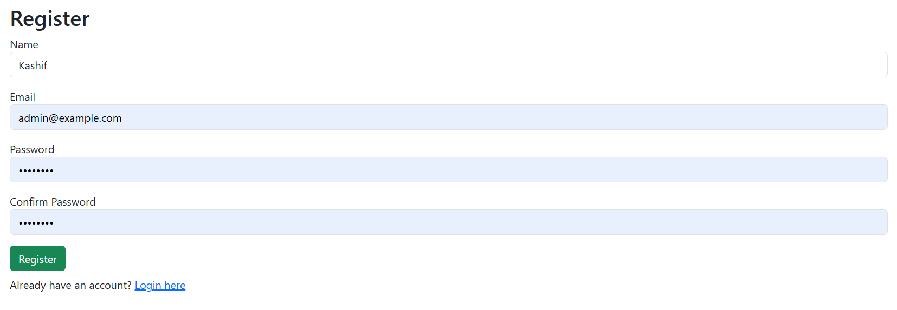
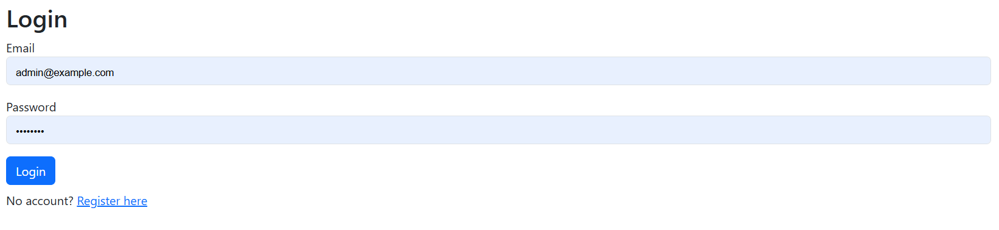
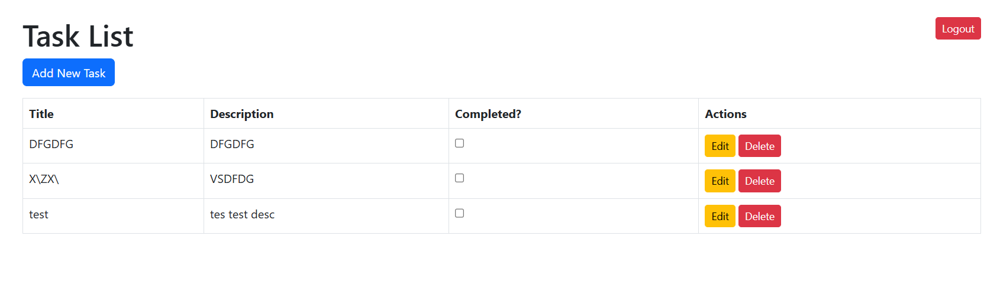
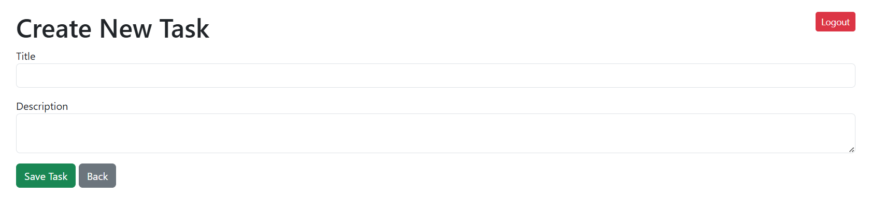
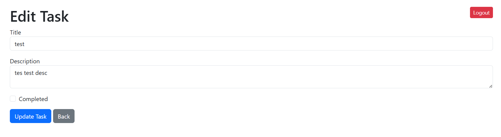

# Laravel To-Do List Application 📝

A simple and clean **Laravel-based To-Do List Web App** to manage your daily tasks efficiently.  
This project demonstrates a practical approach to building a basic CRUD system in Laravel using Bootstrap for styling.

---

## 📸 Screenshots

### 🔐 User Authentication



### 📋 Task List Page


### ✍️ Create New Task


### ✍️ Edit Existing Task



---

## 🚀 Features

- User Registration and Login (Manually built)
- Add, Edit, and Delete Tasks
- Mark Tasks as Completed/Incomplete directly from the list
- Full CRUD operations
- Task Pagination
- Responsive Bootstrap 5 design
- Secure access to task management for authenticated users only

---

## 🛠️ Technologies Used

- Laravel 11
- PHP 8.x
- MySQL
- Bootstrap 5
- HTML5/CSS3

---

## 🏗️ How to Setup

1. Clone the repository:
    ```bash
    git clone https://github.com/kashifiqbalbangash/laravel-todo-app.git
    cd laravel-todo-app
    ```

2. Install PHP dependencies:
    ```bash
    composer install
    ```

3. Configure environment variables:
    ```bash
    cp .env.example .env
    php artisan key:generate
    ```

4. Update `.env` file with your database details:
    ```dotenv
    DB_DATABASE=todo_app
    DB_USERNAME=root
    DB_PASSWORD=
    ```

5. Run database migrations:
    ```bash
    php artisan migrate
    ```

6. (Optional) Install and build frontend assets:
    ```bash
    npm install
    npm run dev
    ```

7. Start the development server:
    ```bash
    php artisan serve
    ```

8. Access the app in your browser:
    ```
    http://localhost:8000
    ```

---

## 📂 Folder Structure Highlights

- `app/Models/Task.php` – Task model
- `app/Http/Controllers/TaskController.php` – Controller handling CRUD operations
- `resources/views/tasks/` – Blade templates for task management
- `routes/web.php` – All routes definitions

---

> Developed with care and best coding practices.